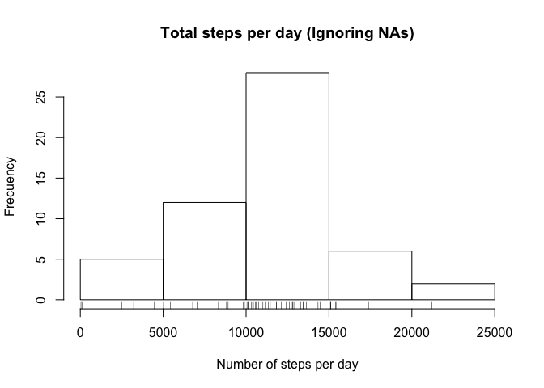
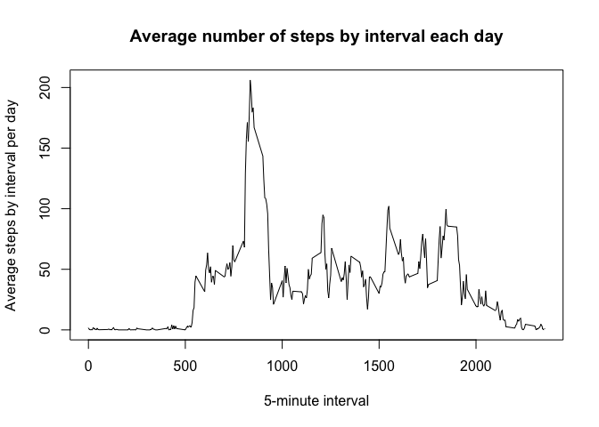
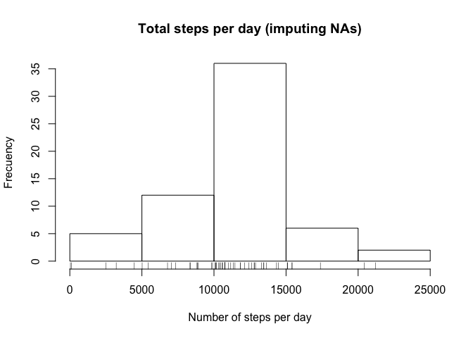
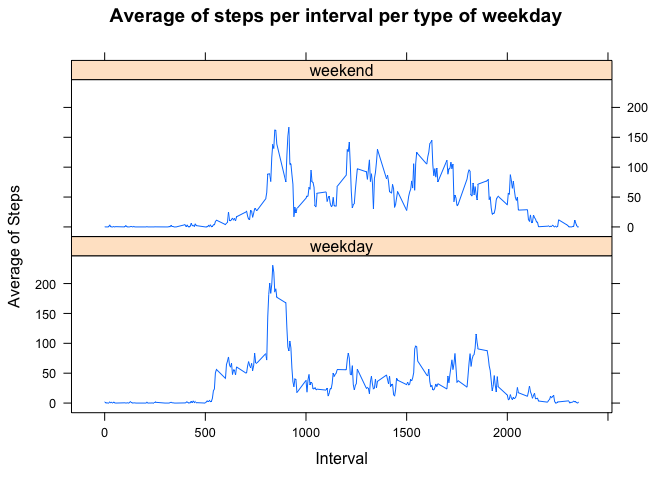

# Reproducible Research: Peer Assessment 1


## Loading and preprocessing the data

```r
setwd("~/desktop/RepData_PeerAssessment1") 
activity <- read.csv("activity.csv")   
```


## What is mean total number of steps taken per day?
Calculate the total number of steps by day

```r
agg<- aggregate(steps~date, activity, sum, na.rm=T)
head(agg)
```

```
##         date steps
## 1 2012-10-02   126
## 2 2012-10-03 11352
## 3 2012-10-04 12116
## 4 2012-10-05 13294
## 5 2012-10-06 15420
## 6 2012-10-07 11015
```

This is an histogram of the total of steps by day


```r
hist(agg$steps, main="Total steps per day (Ignoring NAs)", xlab ="Number of steps per day", ylab="Frecuency")
rug(agg$steps)
```

 

And the mean and median are


```r
c(mean = mean(agg$steps),median = median(agg$steps))
```

```
##     mean   median 
## 10766.19 10765.00
```

## What is the average daily activity pattern?
First calculate the average per interval

```r
ave<-aggregate(steps ~ interval, activity, mean, na.rm=T)
```

This is the plot of the average number of steps by interval each day

```r
plot(ave$interval, ave$steps, type ="l", main= "Average number of steps by interval each day", xlab = "5-minute interval", ylab= "Average steps by interval per day")
```

 


```r
av<- ave[which.max(ave$steps),]
print(av)
```

```
##     interval    steps
## 104      835 206.1698
```
The  interval with the maximum average of steps  across all days is 835, 206.1698113.

## Imputing missing values
### Calculating missing values and creating new dataset with imputed missing values


```r
su <- sum(is.na(activity$steps))
print(su)
```

```
## [1] 2304
```
The total number of  missing values in the steps variables is  2304.

I filled the missing values with the average value of steps in each interval across all days and created a new data base called act2


```r
act2 <- activity
for (i in act2$interval) {
  act2$steps[which(is.na(act2$steps) & act2$interval == i)] <- ave$steps[ave$interval==i]
}
```

Create an histagram with new data base and caluclate mean and median

Calculate the total of steps in each day

```r
agg2<- aggregate(steps~date, act2, sum, na.rm =T)
head(agg2)
```

```
##         date    steps
## 1 2012-10-01 10766.19
## 2 2012-10-02   126.00
## 3 2012-10-03 11352.00
## 4 2012-10-04 12116.00
## 5 2012-10-05 13294.00
## 6 2012-10-06 15420.00
```

This is the histogram with the new values

```r
hist(agg2$steps, main="Total steps per day (imputing NAs)", xlab ="Number of steps per day", ylab="Frecuency")
rug(agg2$steps)
```

 

and these are the values of the median and the mean

```r
c(mean = mean(agg2$steps),median = median(agg2$steps))
```

```
##     mean   median 
## 10766.19 10766.19
```

####There was almost no impact with imputing new values to the missing values

## Are there differences in activity patterns between weekdays and weekends?

First, I created the new factor variable indicating if it is a weekday or a weekend

```r
act2$date <- as.Date(act2$date)
act2$weekday <- weekdays(act2$date)
act2$weekend <- ""

 for (i in 1:nrow(act2)) {
   if (act2[i,]$weekday %in% c("Saturday", "Sunday")) {
     act2[i,]$weekend <- "weekend"
   }
   else {
     act2[i,]$weekend <- "weekday"
   }
 }
act2$weekend<-as.factor(act2$weekend)
str(act2)
```

```
## 'data.frame':	17568 obs. of  5 variables:
##  $ steps   : num  1.717 0.3396 0.1321 0.1509 0.0755 ...
##  $ date    : Date, format: "2012-10-01" "2012-10-01" ...
##  $ interval: int  0 5 10 15 20 25 30 35 40 45 ...
##  $ weekday : chr  "Monday" "Monday" "Monday" "Monday" ...
##  $ weekend : Factor w/ 2 levels "weekday","weekend": 1 1 1 1 1 1 1 1 1 1 ...
```
Finally, I created a panel with two line plots, each on reporting the average number of steps in each 5- min interval averaged by type of day

```r
library(lattice)
ave2<-aggregate(steps ~ interval+weekend, act2, mean)
xyplot(ave2$steps~ ave2$interval|ave2$weekend, 
       type = "l", 
       layout=c(1,2),
       main = "Average of steps per interval per type of weekday",
        xlab="Interval",
       ylab="Average of Steps"
  )
```

 
After seeing both plots we can affirm that there are some difference between each type of day. While in weekends the average steps per interval is more constant, in weekdays we can see a huge amount before the 1000 interval.
